# Party Playlist Request System - Workflow Diagram

This diagram shows the complete architecture and workflow of the Party Playlist Request system. Import this into [Mermaidchart.com](https://www.mermaidchart.com/) to visualize the system flow.

```mermaid
graph TB
    %% User Interfaces
    Guest[👤 Guest User<br/>Mobile/Desktop Browser]
    Admin[🎛️ Admin Panel<br/>DJ Interface]
    Display[📺 Display Screen<br/>TV/Tablet/Mobile]
    
    %% Core Application Layer
    subgraph "Next.js Application"
        HomePage[🏠 Home Page<br/>Song Request Interface]
        AdminPages[⚙️ Admin Pages<br/>Overview/Requests/Settings/Spotify]
        DisplayPage[📺 Display Page<br/>Now Playing/Queue/Messages]
        
        subgraph "API Routes (Serverless)"
            RequestAPI[📝 /api/request<br/>Submit Song Request]
            SearchAPI[🔍 /api/search<br/>Spotify Track Search]
            AdminAPI[🔐 /api/admin/*<br/>Admin Operations]
            SpotifyAPI[🎵 /api/spotify/*<br/>OAuth & Playback Control]
            DisplayAPI[📺 /api/display/*<br/>Current Track & Queue]
            NotificationAPI[🔔 /api/notifications<br/>System Messages]
        end
    end
    
    %% Data Layer
    subgraph "Database (PostgreSQL)"
        RequestsTable[(📋 requests<br/>Track requests & status)]
        SettingsTable[(⚙️ settings<br/>System configuration)]
        AdminsTable[(👨‍💼 admins<br/>Admin accounts)]
        SpotifyAuthTable[(🔑 spotify_auth<br/>OAuth tokens)]
        EventSettingsTable[(🎉 event_settings<br/>Event configuration)]
        NotificationsTable[(🔔 notifications<br/>System messages)]
        OAuthSessionsTable[(🔐 oauth_sessions<br/>OAuth state management)]
    end
    
    %% External Services
    subgraph "External Services"
        SpotifyWebAPI[🎵 Spotify Web API<br/>Search, Playback, Queue]
        PusherService[📡 Pusher<br/>Real-time Updates]
        SpotifyPlayer[🎧 Spotify Player<br/>Active Device]
    end
    
    %% Authentication & State Management
    subgraph "Core Services"
        AuthService[🔐 Auth Service<br/>JWT Token Management]
        SpotifyService[🎵 Spotify Service<br/>API Integration]
        PusherLib[📡 Pusher Library<br/>Real-time Events]
        DatabaseLib[💾 Database Library<br/>PostgreSQL Operations]
    end
    
    %% User Flows
    Guest --> HomePage
    HomePage --> RequestAPI
    HomePage --> SearchAPI
    
    Admin --> AdminPages
    AdminPages --> AdminAPI
    AdminPages --> SpotifyAPI
    
    Display --> DisplayPage
    DisplayPage --> DisplayAPI
    DisplayPage --> NotificationAPI
    
    %% API to Services Flow
    RequestAPI --> DatabaseLib
    RequestAPI --> PusherLib
    SearchAPI --> SpotifyService
    AdminAPI --> AuthService
    AdminAPI --> DatabaseLib
    AdminAPI --> PusherLib
    SpotifyAPI --> SpotifyService
    SpotifyAPI --> DatabaseLib
    DisplayAPI --> DatabaseLib
    NotificationAPI --> DatabaseLib
    
    %% Service to External Flow
    SpotifyService --> SpotifyWebAPI
    SpotifyService --> SpotifyPlayer
    PusherLib --> PusherService
    
    %% Database Connections
    DatabaseLib --> RequestsTable
    DatabaseLib --> SettingsTable
    DatabaseLib --> AdminsTable
    DatabaseLib --> SpotifyAuthTable
    DatabaseLib --> EventSettingsTable
    DatabaseLib --> NotificationsTable
    DatabaseLib --> OAuthSessionsTable
    
    %% Real-time Updates Flow
    PusherService -.->|Real-time Events| HomePage
    PusherService -.->|Real-time Events| AdminPages
    PusherService -.->|Real-time Events| DisplayPage
    
    %% Spotify Integration Flow
    SpotifyWebAPI -.->|Track Data| SearchAPI
    SpotifyWebAPI -.->|Playback State| AdminAPI
    SpotifyPlayer -.->|Queue Updates| SpotifyWebAPI
    
    %% Complex Workflow Paths
    subgraph "Song Request Workflow"
        direction TB
        A1[1. Guest searches for song] --> A2[2. Spotify API returns results]
        A2 --> A3[3. Guest submits request]
        A3 --> A4[4. Request stored in database]
        A4 --> A5[5. Pusher notifies admin panel]
        A5 --> A6[6. Admin approves/rejects]
        A6 --> A7[7. If approved: Add to Spotify queue]
        A7 --> A8[8. Pusher notifies display screen]
        A8 --> A9[9. Display updates with new queue]
    end
    
    %% Authentication Flow
    subgraph "Admin Authentication"
        direction TB
        B1[1. Admin enters credentials] --> B2[2. Server validates password]
        B2 --> B3[3. JWT token generated]
        B3 --> B4[4. Token stored in localStorage]
        B4 --> B5[5. Pusher notifies all clients]
        B5 --> B6[6. Page controls updated globally]
    end
    
    %% Real-time Synchronization
    subgraph "Cross-Device Synchronization"
        direction TB
        C1[Admin makes change] --> C2[Pusher broadcasts event]
        C2 --> C3[All connected devices receive update]
        C3 --> C4[UI updates automatically]
        C4 --> C5[State synchronized across devices]
    end
    
    %% Styling
    classDef userInterface fill:#e1f5fe,stroke:#01579b,stroke-width:2px
    classDef apiLayer fill:#f3e5f5,stroke:#4a148c,stroke-width:2px
    classDef database fill:#e8f5e8,stroke:#1b5e20,stroke-width:2px
    classDef external fill:#fff3e0,stroke:#e65100,stroke-width:2px
    classDef service fill:#fce4ec,stroke:#880e4f,stroke-width:2px
    classDef workflow fill:#f1f8e9,stroke:#33691e,stroke-width:2px
    
    class Guest,Admin,Display userInterface
    class HomePage,AdminPages,DisplayPage,RequestAPI,SearchAPI,AdminAPI,SpotifyAPI,DisplayAPI,NotificationAPI apiLayer
    class RequestsTable,SettingsTable,AdminsTable,SpotifyAuthTable,EventSettingsTable,NotificationsTable,OAuthSessionsTable database
    class SpotifyWebAPI,PusherService,SpotifyPlayer external
    class AuthService,SpotifyService,PusherLib,DatabaseLib service
    class A1,A2,A3,A4,A5,A6,A7,A8,A9,B1,B2,B3,B4,B5,B6,C1,C2,C3,C4,C5 workflow
```

## Key Components Overview

### User Interfaces
- **Guest Interface**: Song request form with search functionality
- **Admin Panel**: Multi-page dashboard for managing requests and settings
- **Display Screen**: Real-time display of current track, queue, and messages

### API Architecture
- **Serverless Functions**: Next.js API routes handling all backend operations
- **RESTful Endpoints**: Organized by functionality (admin, spotify, display, etc.)
- **Real-time Communication**: Pusher integration for instant updates

### Database Schema
- **7 Main Tables**: Requests, settings, admins, Spotify auth, event settings, notifications, OAuth sessions
- **PostgreSQL**: Hosted on Vercel with connection pooling

### External Integrations
- **Spotify Web API**: Search, playback control, queue management
- **Pusher**: Real-time event broadcasting across all connected devices
- **Spotify Player**: Physical device for music playback

## Critical Workflow Paths

1. **Song Request Flow**: Guest → Search → Request → Admin Approval → Spotify Queue → Display Update
2. **Admin Authentication**: Login → JWT → localStorage → Pusher Broadcast → Global State Sync
3. **Real-time Sync**: Any Change → Pusher Event → All Devices Update → Consistent State

## Complexity Indicators

- **Multiple State Management**: localStorage, database, Pusher events, React state
- **Cross-Device Synchronization**: Admin status affects all connected devices
- **Dual Authentication Logic**: Admin vs regular user paths throughout the application
- **Complex Page Control System**: Dynamic enabling/disabling of pages based on admin state
- **Multiple Real-time Channels**: Different event types for different components

